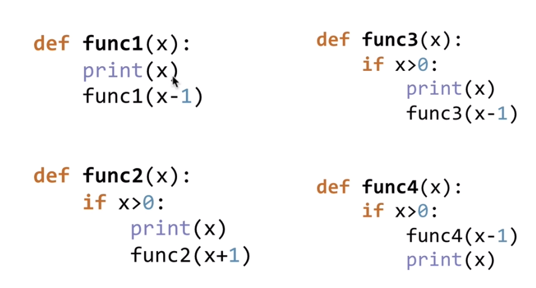
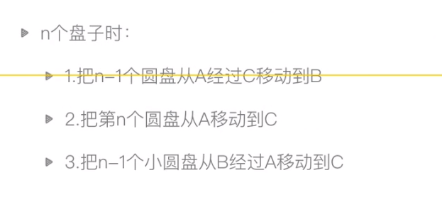
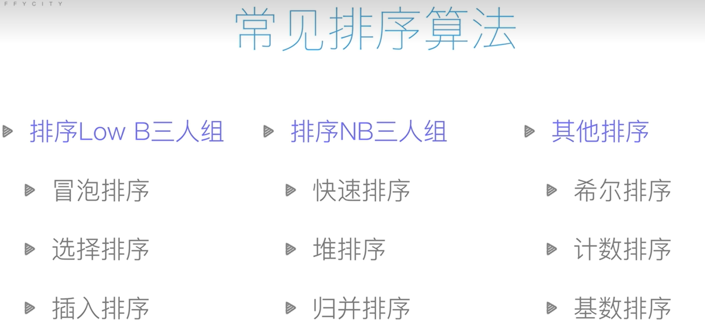
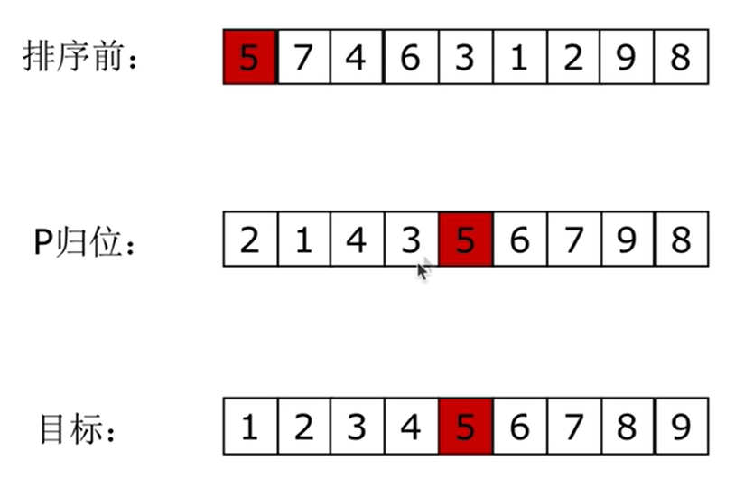
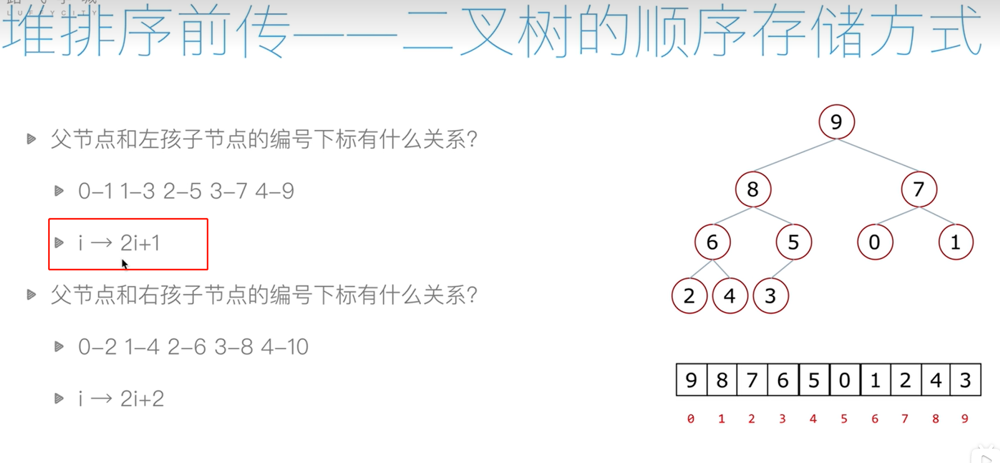

#### 1、递归

递归的两个特点



- 调用自身
- 结束条件

#####  汉诺塔问题



```python
def haoni(n, a, b, c):
    if n > 0:
        haoni(n - 1, a, c, b)
        print(n, " moving from %s to %s" % (a, c))
        haoni(n - 1, b, a, c)
```

#### 2.查找

- 在一些数据元素中，通过一定的方法找出与给定关键字想通过的数据元素的过程。

- 列表查找（线性表查找）：从列表元素中查找指定元素。

  - 输入：列表、待查找元素
  - 输出：元素下标（未找到元素时一般返回None或-1）

- 内置列表查找函数：index() 

##### 顺序查找(Linear Search)

也叫线性查找，从列表第一个元素开始，顺序进行搜索，直到找到元素或搜索到列表最后一个元素为止。

```python
def linear_search(data_list, target_value):
    """
    线性查找
    :param data_list:
    :param target_value:
    :return:
    """
    for i, val in enumerate(data_list):
        if val == target_value:
            return i
    else:
        return None
```

时间复杂度O(n) 

##### 二分查找(Binary Search)

折半查找，从有序列表的初始候选区li[0:n]开始，通过对待查找的值与候选区中间值的比较，可以使候选区减去一半  。

**代码实现 **

```python
def binary_search(data_list, target_value):
    left = 0
    right = len(data_list) - 1

    while left <= right:
        mid = (left + right) // 2
        if data_list[mid] == target_value:
            return mid
        elif data_list[mid] < target_value:
            left = mid + 1
        else:
            right = mid - 1
    else:
        return None
```

复杂度O（logN）

###   排序 



#### 冒泡排序(Bubble Sort)

##### 初始版本

- 列表每两个相邻的数，如果前面比后面大，则交换这两个数。
- 一趟排序完成后，则无序区减少一个属，有序区增加一个数。
- 代码关键点：趟、无序区范围

- 分为有序区和无序区 无序区随着每一趟排序减小，有序区随着每一趟排序增大

```python
def bubble_sort(li):
    for i in range(len(li)-1):
        # 第i趟排序
        for j in range(len(li)-i-1):
            # 无序区元素冒泡
            if li[j] > li[j+1]:
                li[j], li[j+1] = li[j+1], li[j]
                
```

时间复杂度 O(n^2) 

##### 优化版

- 如果冒泡排序中的一趟排序没有发生交换，则说明列表已经有序，可以直接结束算法。

```python
def bubble_sort(li):
    for i in range(len(li)-1):
        # 第i趟排序
        exchange = False
        for j in range(len(li)-i-1):
            # 无序区元素冒泡
            if li[j] > li[j+1]:
                exchange = True
                li[j], li[j+1] = li[j+1], li[j]
         if not exchange:
            return
li = [10,2,3,4,5,6,7,8,1]
```

#### 选择排序(Select sort)

- 一趟排序记录最小的数，放到第一个位置
- 再一趟排序记录记录列表无序区最小的数，放到第二个位置
- 。。。。
- 算法关键: 有序区和无序区、无序区最小数的位置

```python
def select_sort(li):
    for i in range(len(li)-1): # 无序区只剩一个元素时它就是有序的
        min_loc = i
        for j in range(i+1, len(li)):
            if li[j] < li[min_loc]:
                min_loc = j
        li[i], li[min_loc] = li[min_loc], li[i]

```

时间复杂度:O(n^2)

#### 插入排序(insert select)

- 将无序元素一个一个的插入到有序区间

```python
def insert_sort(li):
    for i in range(1, len(li)):  # i代表摸到的牌的下标
        tmp = li[i] # 当前摸到的牌
        j = i -1 # j指的是手里的牌
        while j >=0 and li[j] > tmp:
            li[j+1] = li[j]
            j -= 1
        li[j+1] = tmp # 插入
```


#### 冒泡、选择、插入 时间复杂度都是n^2 都是原地排序

#### 快速排序

- 特点快
- 取一个元素p(第一个元素)， 使用元素p归位；
- 列表被p分成两大部分， 左边都比p小，右边都比p大
- 递归完成排序

 

```python
def partition(li, left, right):
    tmp = li[left]
    while left < right:
        while left < right and li[right] >= tmp:  # 从右面找比tmp小的数
            right -= 1  # 往左走一步
        li[left] = li[right]   # 把右边的值写到左边
        
        while left < right and li[left] <= tep:  # 从左边找比temp大的数
            left += 1
         li[right] = li[left]  # 把左边的值写到右边空位
    li[left] = tmp  # 把tmp归位
  	return left

def quick_sort(li, left, right):
    if left < right:
        mid = partition(li, left, right)
        quick_sort(li, left, mid-1)
        quick_sort(li, mid+1, right)

        
if __name__ == '__main__':
    data_list = [3, 4, 2, 1, 5, 6, 7, 8]
    print(data_list)
    quick_sort(data_list, 0, len(data_list) - 1)
    print(data_list)

```

##### 快速排序的效率

- 快速排序的时间复杂度  O（nlogn)

快速排序的问题：

- 最坏情况 时间复杂度达到O(n^2)
- 递归

#### 堆排序

##### 树与二叉树

- 根节点、叶子节点   叶子节点：不能分叉的节点
- 树的深度（高度） 最深有几层 
- 树的度   整个树里最大的节点分了几个叉 度就为几
- 孩子节点/父节点
- 子树

##### 二叉树

- 满二叉树： **每层的结点数都达到最大值**，则这个二叉树就是满二叉树。
- 完全二叉树： **叶节点**只能出现在**最下层和次下层**，并且**最下面一层的节点**都集中在**该层最左边**的若干位置的二叉树

二叉树的存储方式

- 顺序存储方式
  - 
  - 父节点找孩子节点 i ---> 2i+1  
  - 孩子节点找父节点 i——>(i-1)/2

- 链式存储方式